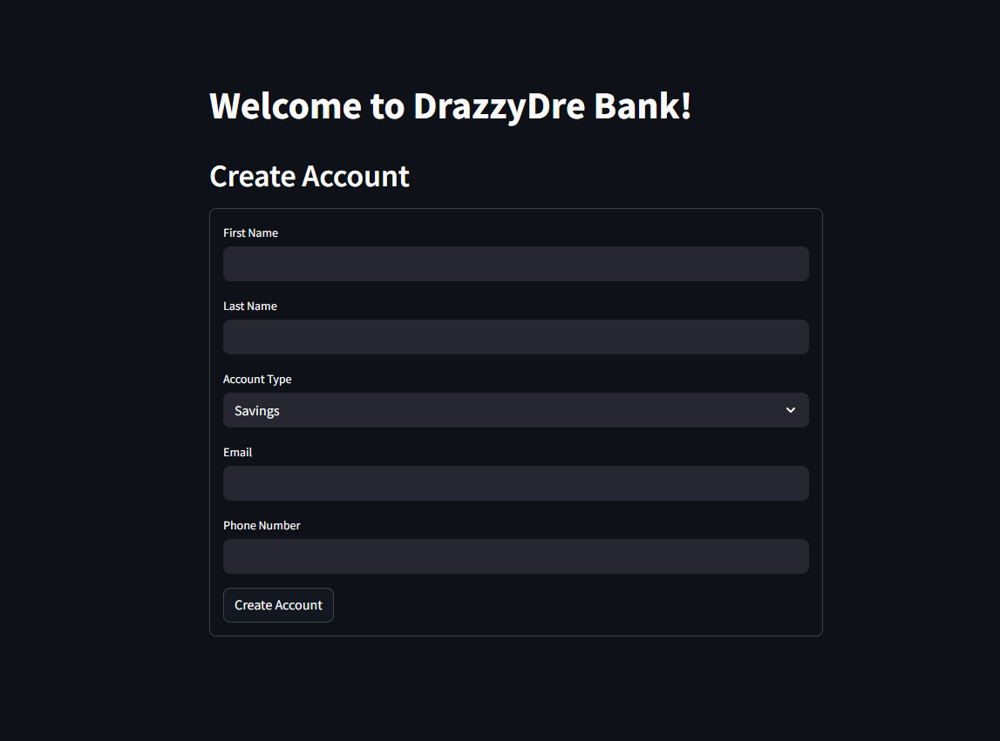

# Streamlit Bank Application


This project is a simple banking application built using Streamlit. It allows users to create accounts, deposit and withdraw funds, transfer money, and check their account balances. The application is designed to provide an interactive and user-friendly experience.

---

## Project Structure

```
streamlit-bank-app
├── src
│   ├── app.py          # Main entry point of the Streamlit application
│   ├── bank.py         # Contains the Bank class with banking logic
│   └── utils.py        # Utility functions for input validation and formatting
├── requirements.txt     # Lists the dependencies required for the project
└── README.md            # Documentation for the project
```
---

## Setup Instructions

1. **Clone the repository:**
   ```
   git clone <repository-url>
   cd streamlit-bank-app
   ```

2. **Create a virtual environment (optional but recommended):**
   ```
   python -m venv venv
   source venv/bin/activate  # On Windows use `venv\Scripts\activate`
   ```

3. **Install the required dependencies:**
   ```
   pip install -r requirements.txt
   ```

---

## Usage

To run the application, execute the following command in your terminal:

```
streamlit run src/app.py
```

This will start the Streamlit server and open the application in your default web browser.

---

## Features

- **Account Creation:** Users can create a new bank account by providing their personal details.
- **Deposit Funds:** Users can deposit money into their accounts.
- **Withdraw Funds:** Users can withdraw money from their accounts, with checks for sufficient balance.
- **Transfer Funds:** Users can transfer money to other accounts by entering the recipient's account number.
- **Check Balance:** Users can view their current account balance.
- **User-Friendly Interface:** The application is designed to be intuitive and easy to navigate.

---
## Preview

Here is a preview of the **Bank App/ATM** in action:



---

## 🚀 Live Demo


You can try out the app here:  
👉 [Launch the App](https://bank-app-atm.streamlit.app/)

---

## Contributing


Contributions are welcome! If you have suggestions for improvements or new features, feel free to open an issue or submit a pull request.

---

## License

This project is licensed under the MIT License. See the [LICENSE](LICENSE) file for more details.
